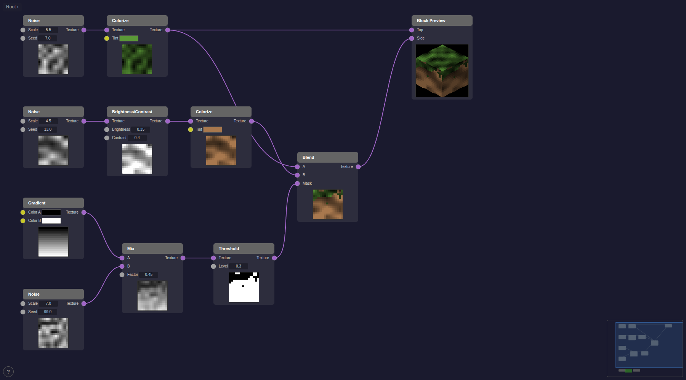

# dwind-nodes

A Blender-style node graph editor for Rust / WASM, built on
[dwind](https://github.com/JedimEmO/dwind) /
[dominator](https://github.com/Pauan/rust-dominator) /
[futures-signals](https://github.com/Pauan/rust-signals). Pure SVG rendering,
signal-driven reactivity, and a small expressive API.



**[Live Demo](https://mathiasmyrland.github.io/dwind-nodes/)**

## What it is

A reusable node-graph component you can drop into a dominator app. You register
node types, wire up the editor, and the library handles rendering, interaction,
undo/redo, grouping, serialization — and exposes the graph as
[`futures-signals`](https://docs.rs/futures-signals) streams so your
evaluation/UI layer can react to changes the same way everything else in a
dominator app does.

## Features

- **Pure SVG rendering** with `foreignObject` for HTML node content — zooms
  and pans crisply, no canvas fallback needed.
- **Signal-driven reactivity** — `node_list` / `connection_list` /
  `selection` / per-node `node_positions` are all
  [`MutableVec`](https://docs.rs/futures-signals/latest/futures_signals/signal_vec/struct.MutableVec.html) /
  [`Mutable`](https://docs.rs/futures-signals/latest/futures_signals/signal/struct.Mutable.html)
  handles you can subscribe to directly.
- **Interaction suite**: drag nodes, connect ports, box-select, cut-links,
  pan / zoom, drag-to-connect with type-compatibility highlighting.
- **Node groups** with subgraph navigation and breadcrumb trail.
- **Frames** — visual grouping with drag-to-move, rename, color picker.
- **Reroute nodes** (diamond pass-throughs) for tidy wire management.
- **Search menu** (`Shift+A`) with type-compatible filtering and
  drop-noodle-to-add.
- **Right-click context menu** with per-target actions.
- **Minimap** with click-to-pan.
- **Theme system** — centralised colour / opacity configuration.
- **Snapshot undo / redo** (`Ctrl+Z` / `Ctrl+Shift+Z`).
- **Topological sort** for dependency-ordered evaluation.
- **Full serialisation** (JSON) including the subgraph hierarchy.
- **Inline port widgets** for editing disconnected-port values.
- **Auto-insert on wire** — drop a node onto a connection to splice it in.
- **Auto-reconnect on delete** — removing a node bridges compatible neighbours.

## Crates

| Crate | Description |
|-------|-------------|
| `nodegraph-core` | Graph data model, ECS store, interaction, layout, serialization |
| `nodegraph-render` | SVG rendering, reactive signals, UI components |
| `nodegraph-widgets` | Compact inline input widgets (float, int, bool, string) |

## Quick Start

```rust
use nodegraph_core::{SocketType, PortDirection, NodeTypeDefinition, PortDefinition};
use nodegraph_render::{GraphSignals, render_graph_editor};

// 1. Create the editor.
let gs = GraphSignals::new();

// 2. Register node types (these show up in the Shift+A search menu).
gs.registry.borrow_mut().register(NodeTypeDefinition {
    type_id: "add".into(),
    display_name: "Add".into(),
    category: "Math".into(),
    input_ports: vec![
        PortDefinition { direction: PortDirection::Input, socket_type: SocketType::Float, label: "A".into() },
        PortDefinition { direction: PortDirection::Input, socket_type: SocketType::Float, label: "B".into() },
    ],
    output_ports: vec![
        PortDefinition { direction: PortDirection::Output, socket_type: SocketType::Float, label: "Result".into() },
    ],
});

// 3. Add nodes — returns (node_id, port_ids).
let (_a, ports_a) = gs.add_node_typed("Constant", Some("constant"), (50.0, 100.0), vec![
    (PortDirection::Output, SocketType::Float, "Value".to_string()),
]);

let (_b, ports_b) = gs.add_node_typed("Add", Some("add"), (300.0, 100.0), vec![
    (PortDirection::Input, SocketType::Float, "A".to_string()),
    (PortDirection::Input, SocketType::Float, "B".to_string()),
    (PortDirection::Output, SocketType::Float, "Result".to_string()),
]);

// 4. Connect ports — returns Result with typed errors.
gs.connect_ports(ports_a[0], ports_b[0]).unwrap();

// 5. Render into the DOM.
dominator::append_dom(&dominator::body(), render_graph_editor(gs));
```

## Reacting to graph changes

Most graph state is exposed as signals, so you subscribe the same way you would
to any other dominator state. The simplest pattern — re-run your evaluator
whenever the graph structure changes:

```rust
use futures_signals::signal::SignalExt;

let gs2 = gs.clone();
wasm_bindgen_futures::spawn_local(async move {
    gs2.structure_changes_signal()
        .for_each(move |_| {
            evaluate(&gs2);   // your own evaluator
            async {}
        })
        .await;
});
```

For finer-grained reactivity, subscribe directly to the underlying `MutableVec` /
`Mutable` handles:

- `gs.node_list.signal_vec_cloned()` — `VecDiff` stream of node add / remove / move
- `gs.connection_list.signal_vec_cloned()` — same for connections
- `gs.selection.signal_cloned()` — current selection as `Vec<EntityId>`
- `gs.get_node_position_signal(node_id)` — live position for one node

A small number of mutations that carry *ephemeral* data (the old → new port-ID
map produced by group / ungroup) remain exposed as callbacks:

```rust
gs.set_on_group(move |group_id, subgraph_id, port_map| {
    // migrate any external state keyed by the old port IDs
});
```

## Examples

Both ship with working `trunk serve` configurations. Run them from the example
directory.

### [`trivial-calculator`](examples/trivial-calculator) — eager evaluation

A three-node-type calculator (Constant, Add, Display) demonstrating graph
traversal plus inline float-input widgets. Re-evaluates the entire graph on any
structural change by subscribing to `structure_changes_signal`. Good starting
point for simple dataflow-evaluator patterns.

### [`texture-generator`](examples/texture-generator) — reactive signal graph

A Blender-style procedural texture compositor. Every image-producing port owns
its own `Mutable<TextureBuffer>`; connections are modelled as dynamic signal
sources so downstream recompute is *automatic* and purely local to the changed
input. Ships with ~15 node types (noise, checker, gradient, brick, mix, blend,
brightness/contrast, threshold, invert, colorize, plus preview / tiled-preview
/ iso-preview / block-preview sinks) and a default scene that builds a
Minecraft-style grass block from grass and dirt noise composed through a
jagged-mask blend — shown in the screenshot above.

## Keyboard Shortcuts

| Key | Action |
|-----|--------|
| `?` | Toggle help overlay |
| `Shift+A` | Open search menu (add node) |
| `Delete` / `X` | Delete selected |
| `Ctrl+Z` | Undo |
| `Ctrl+Shift+Z` | Redo |
| `Shift+D` | Duplicate selected |
| `G` | Group selected nodes |
| `Shift+G` | Ungroup |
| `F` | Create frame around selected |
| `H` | Toggle collapse |
| `M` | Toggle mute |
| `A` | Select all / deselect all |
| Middle mouse | Pan |
| Scroll | Zoom |
| `Ctrl`+right-drag | Cut links |

## Building

Requires [Trunk](https://trunkrs.dev/) for WASM builds:

```bash
# Run the demo
cd crates/nodegraph-demo && trunk serve

# Run the trivial-calculator example
cd examples/trivial-calculator && trunk serve

# Run the texture-generator example
cd examples/texture-generator && trunk serve
```

## Testing

```bash
# Native unit tests (graph / store / interaction / serialization)
cargo test --workspace

# WASM DOM tests — exercise live signal-driven rendering in a real browser
wasm-pack test --headless --firefox crates/nodegraph-render

# Full CI gate (matches .github/workflows/ci.yml)
cargo fmt --all --check
cargo clippy --workspace --all-targets -- -D warnings
cargo clippy --workspace --target wasm32-unknown-unknown -- -D warnings
cargo check --workspace --target wasm32-unknown-unknown
```

## License

MIT — see [LICENSE](LICENSE).
